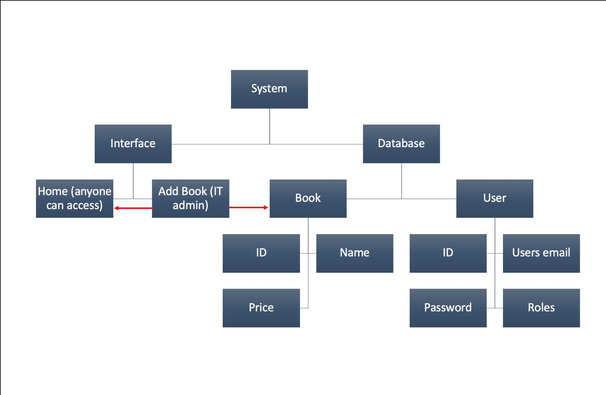

Hi, this is a BookStore.com project made with Java.
All packages used can be seen in pom.xml

Made with: JDE17, Docker, Mven
# Running project:
1. Download Docker, Java 17, Maven
2. Download this project
### Database:
1. Go to project folder and run in console ***docker compose up -d*** for database.
2. docker exec -it postgres bash
3. psql -U bookuser
4. CREATE DATABASE bookstore;
### Project:
1. Run with mvn spring-boot:run

### Testing details:
1. Go to ***localhost:3000*** in browser
2. Username is ***AUser***, password is ***password***
3. Admin user and Books are added with commandLineRunner after start of the project.

### Describing project:
Maven was chosen as a build automation tool because of its ease of use and more powerful features from other build tools were not necessary.
This project uses Java Spring framework for better security and faster development time.
In authentication Spring Security is used to handle user accounts logins and their credentials.
For UI Thymeleaf templates are used to display data and input forms.
For data storage the most popular relation type database - PostgreSQL was used.
Guest can see all the books.
Only Admin can also access book adding page.

Red arrows represent data and user flow.

